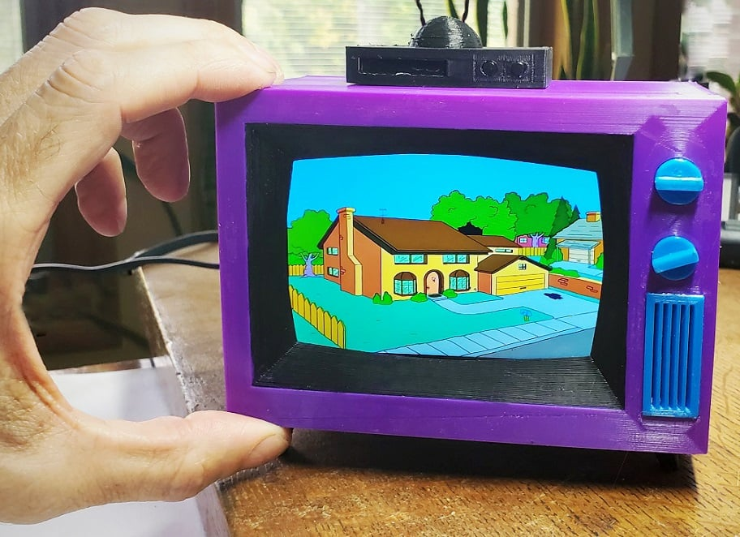

# TinyTV

A small 3D-printed television with a Raspberry Pi inside. It plays a library of
episodes and old commercials on a loop — no menu, no remote, no interface. You
flip the switch on the side and something is on, the way a TV in the corner of a
room used to work.



*Enclosure model and photo by [highping on Thingiverse](https://www.thingiverse.com/thing:5019648), used under CC BY.*

The Pi boots straight into a video player. There is no desktop and nothing to log
into. Episodes are shuffled, and after each one a commercial plays before the
next episode starts — which is most of what makes it feel like television rather
than a video player in a box.

## How it works

Everything is pre-processed on a desktop machine, so the Pi only ever has to do
the easy job of playing files. Videos are encoded down to roughly 780×480 and
rotated to match the panel, black bars cropped, subtitles burned in if there are
any. That happens once, in [code/encoding](code/encoding).

On the Pi, [player.py](code/player/player.py) shuffles the contents of
`videos/tv` and `videos/commercials`, then alternates between them forever. It
plays through `mpv` on the DRM video output, which draws directly to HDMI with no
X server running. Before each file it probes the codec with `ffprobe` and picks
its decoder flags accordingly: H.264 goes to the Pi's hardware decoder, anything
else (H.265, VP9, AV1) falls back to software with the loop filter switched off,
because a Pi 3B has no hardware path for those and will otherwise drop most of
the frames.

Play counts are written to `playback_state.txt` next to the script — a plain text
file you can open and read, on purpose.

[buttons.py](code/player/buttons.py) watches a toggle switch on GPIO 26. When
it's off, GPIO 18 goes low to kill the backlight and GPIO 19 is dropped back to
an input, which cuts the PWM audio feeding the amp. Screen and sound go together,
so the switch on the side of the case behaves like a real power switch.

## Hardware

| Part | Notes |
| --- | --- |
| Raspberry Pi 3B | The player is tuned for its decoder; a newer Pi has more headroom |
| Waveshare 4″ HDMI LCD | 800×480 IPS, resistive touch (unused here), HDMI + USB |
| Waveshare UPS HAT (D) | 2× 5300 mAh cells, INA219 current sensor on I²C `0x43` |
| Adafruit MAX98357 | Class-D mono amp driving a small speaker |
| Toggle switch, 1 kΩ pot, relay | Power and volume on the front panel |

Wiring diagram (again from the original build):
[hardware/3d-print/images/Wiring.jpg](hardware/3d-print/images/Wiring.jpg).
Datasheets for the HAT and the amp are in [hardware/datasheets](hardware/datasheets).

## Layout

```text
boot/          Files that go on the SD card's boot partition before first boot
code/
  player/      What runs on the Pi: playback loop and the power switch handler
  encoding/    Desktop-side ffmpeg tooling that prepares videos for the screen
  monitoring/  Battery, temperature and system telemetry over the INA219
  video-analysis/  Library statistics — how many hours of content is on there
  experiments/ Parked attempts, kept for reference
docs/          Display setup guide and the playback design notes
hardware/      STLs, Fusion 360 source, renders and component datasheets
samples/       An example encoded clip
```

## Getting one running

1. Flash Raspberry Pi OS Lite and set the Pi up headless. The display needs a
   custom HDMI mode and a device tree overlay before it will show anything —
   [docs/pi-display-setup.md](docs/pi-display-setup.md) has the exact
   `config.txt` lines and the touchscreen overlay.
2. Copy the contents of [boot/](boot/) to the boot partition. Fill in your own
   SSID and password in `wpa_supplicant.conf` first.
3. Install the runtime dependencies on the Pi:
   ```bash
   sudo apt install mpv ffmpeg python3-rpi.gpio
   pip3 install pi-ina219 psutil
   ```
4. Encode your videos with [code/encoding/480x800-screen.py](code/encoding/480x800-screen.py)
   and copy them to `code/player/videos/tv` and `code/player/videos/commercials`.
5. Run `python3 player.py`. Once it looks right, put it behind a systemd unit so
   it comes up on boot.

## Known gaps

This is a finished object rather than a finished piece of software, and a few
things never got past "good enough":

- **Playback state only saves on a clean exit.** `player.py` writes
  `playback_state.txt` when you Ctrl+C it. Pull the power — which is how the
  thing is normally switched off — and the session's play counts are lost.
- **The rotation is a shuffle, not the design in the notes.**
  [docs/playback-design.md](docs/playback-design.md) describes a session system
  that picks randomly from what hasn't played yet, survives restarts, and picks
  up new files automatically. `code/experiments/player_WITH-CIRCULATION.py`
  implements it, but it plays through `--hwdec=auto` and stutters badly on a
  3B, so the simpler shuffle is what actually ships.
- **The VCR buttons aren't wired to anything.** The case models two micro
  switches into the VCR on top. Skip and rewind would be the obvious use.
- **No service file.** Starting on boot is left to you.

## Credits

The enclosure is [The Simpsons TV (Remixed for HDMI display)](https://www.thingiverse.com/thing:5019648)
by **highping**, itself a remodel of [buba447's original](https://www.thingiverse.com/thing:4943159).
buba447's [build guide](https://withrow.io/simpsons-tv-build-guide) still covers
most of the hardware side; the display setup is the part that differs.

## License

The code in this repository is MIT licensed — see [LICENSE](LICENSE).

The 3D models in [hardware/3d-print](hardware/3d-print) are not mine and are not
covered by that. They are Creative Commons Attribution, by highping — see
[hardware/3d-print/LICENSE.txt](hardware/3d-print/LICENSE.txt).

Bring your own video. Nothing here ships with content, and the point is to play
things you already own.
